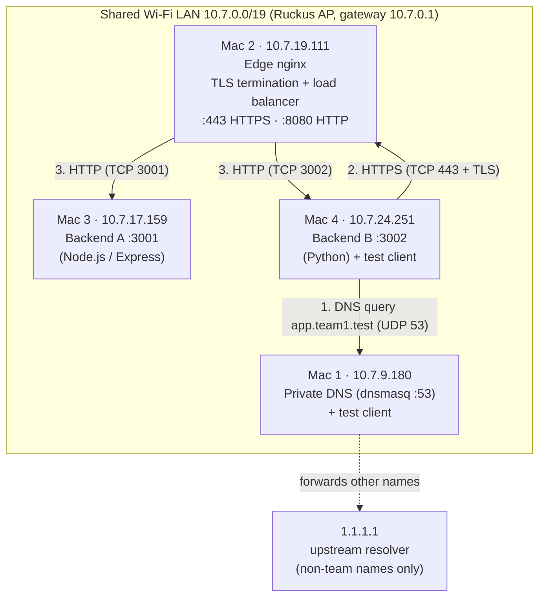
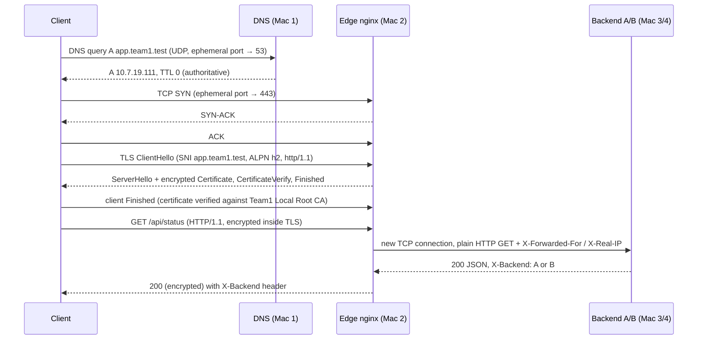
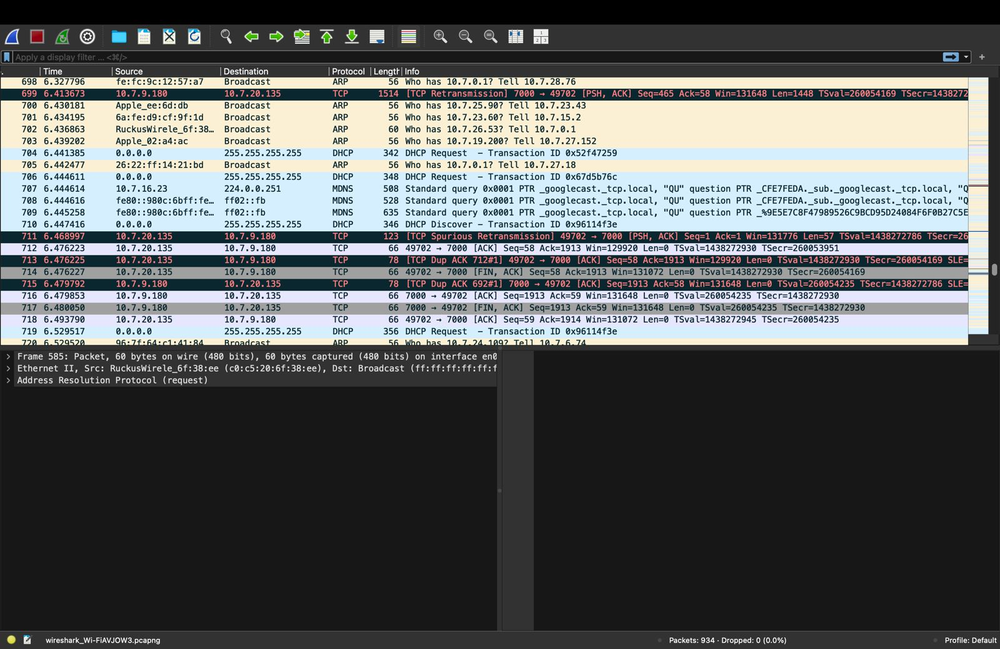
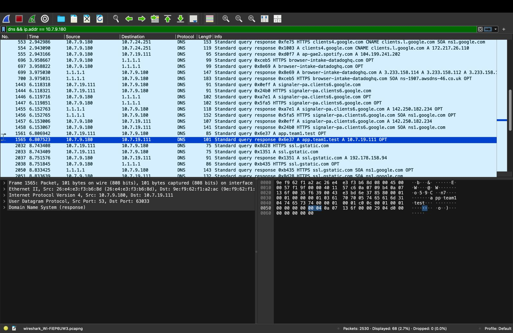
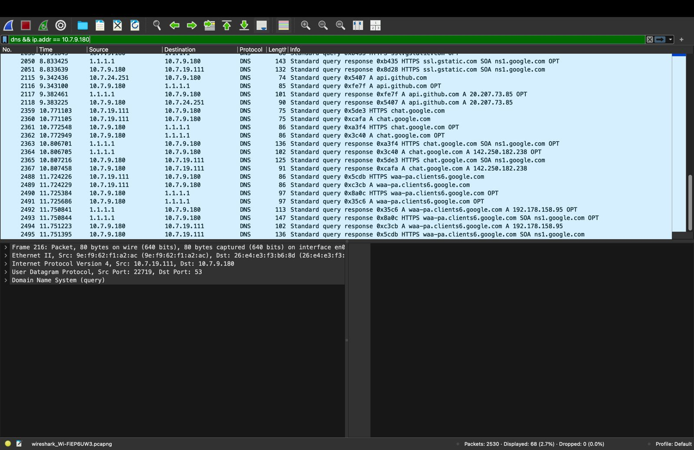
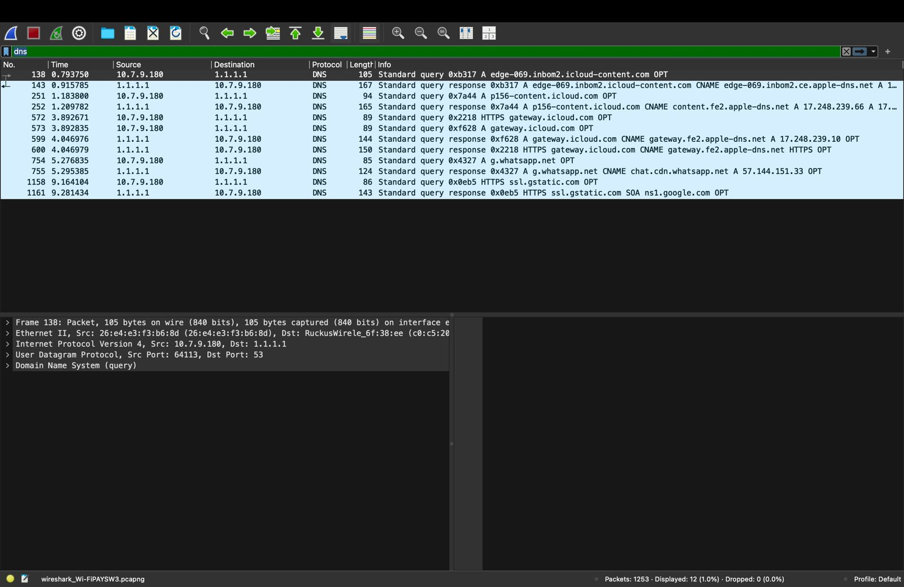
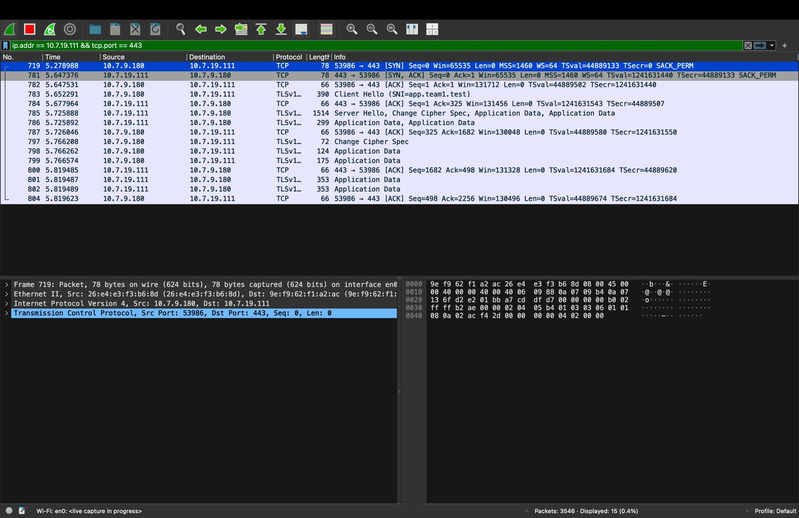
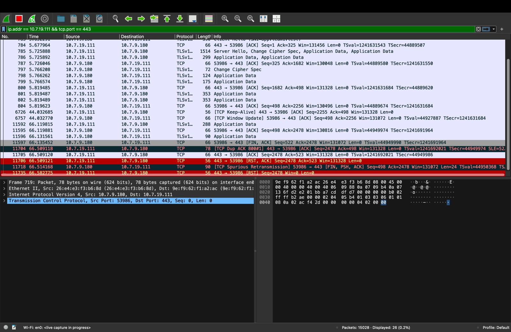
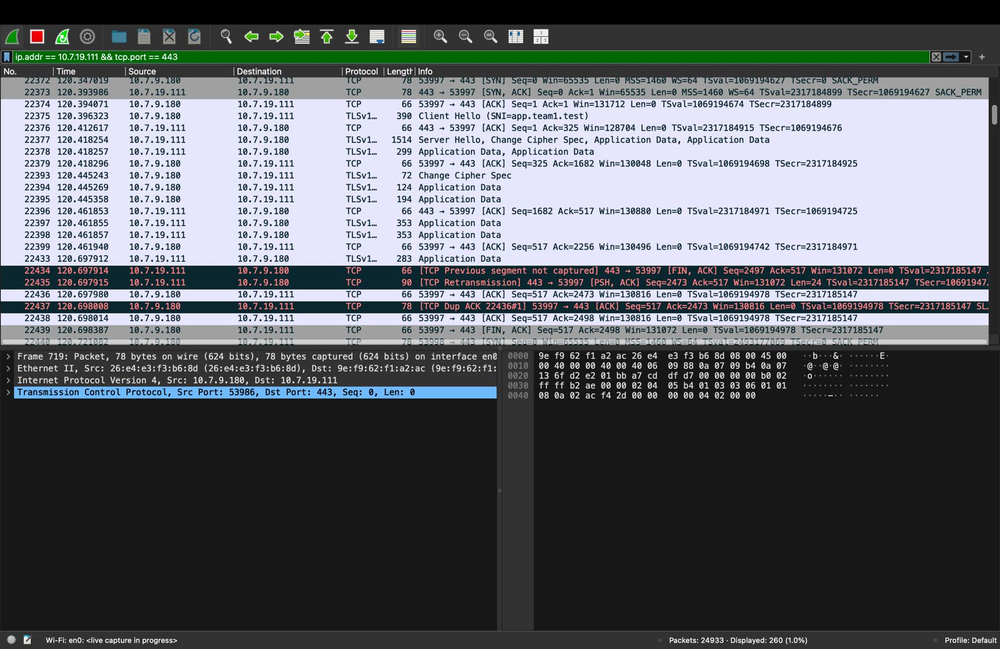
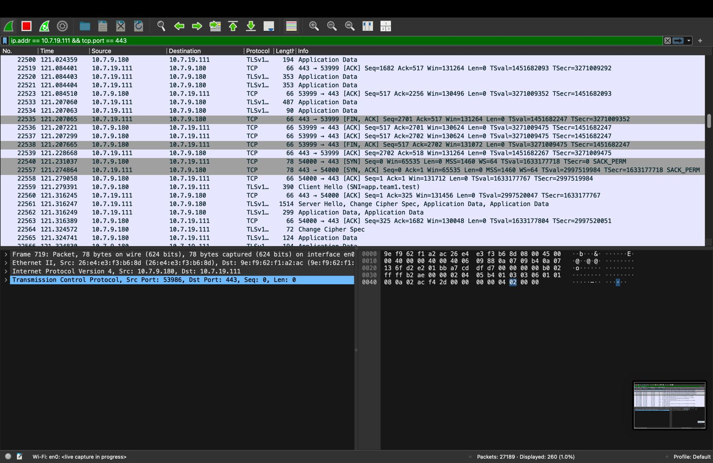

# Private Network Service Platform: Phase 1 Report

**Course:** Computer Networks, Course Project (team-based local networking project)
**Team:** Team 1 · private domain `team1.test`
**Members:** Chirag Lalwani (Mac 1) · Arhan Alam (Mac 2) · Arjun (Mac 3) · Kartik Madaan (Mac 4)
**Environment:** 4 × macOS laptops on one shared Wi-Fi LAN. Everything runs locally, with no cloud services.
**Repository:** <https://github.com/madaankartik/team1-cn-project>

> **Core principle:** the application stays simple. The network is the project.

---

## Table of Contents

1. [Project Purpose & Overview](#1-project-purpose--overview)
2. [Learning Objectives](#2-learning-objectives)
3. [Constraints & Design Decisions](#3-constraints--design-decisions)
4. [Network Architecture](#4-network-architecture)
5. [Repository Structure](#5-repository-structure)
6. [Phase 1: Build & Observe](#6-phase-1-build--observe)
7. [Phase 1: Failure Demonstrations](#7-phase-1-failure-demonstrations)
8. [Troubleshooting Method](#8-troubleshooting-method)
9. [Final Demonstration Sequence](#9-final-demonstration-sequence)
10. [Deliverables & Evidence Index](#10-deliverables--evidence-index)
11. [Learning Summary](#11-learning-summary)
12. [Limitations & Future Work](#12-limitations--future-work)

---

## 1. Project Purpose & Overview

We built a small private service environment on our own laptops and then traced how one request travels from a client to a server and back.

A client Mac on the team LAN can:

1. request `https://app.team1.test` with `curl` or a browser,
2. resolve the name through **our own DNS server** (dnsmasq on Mac 1),
3. open a **verified HTTPS connection** to our **reverse proxy / load balancer** (nginx on Mac 2),
4. receive a response from **one of two backend servers** (Mac 3 = Backend A, Mac 4 = Backend B),
5. and we can **observe every step** (DNS → TCP → TLS → HTTP) with `dig`, `curl -v` and Wireshark.

**Phase 1 gate (passed):** a client resolves `app.team1.test`, connects over HTTPS without `-k`, and receives responses from both backends through the load balancer.

---

## 2. Learning Objectives

| Objective | How the project meets it |
|---|---|
| Turn classroom theory into a working configuration | We configured and ran DNS (dnsmasq), a private PKI (OpenSSL root CA + server certificate), TLS termination and load balancing (nginx), and two TCP services ourselves. |
| Explain where each protocol fits in a real request | Section 4.5 maps every protocol to its layer. Section 4.4 walks through one request end to end. |
| Prove behaviour with tools | Every claim in this report links to saved terminal output (`dig`, `curl -v`, `openssl s_client`, `nginx -t`, `ping`) or a Wireshark screenshot (Section 10). |
| Diagnose failures by isolating layers | Section 7 injects faults at the DNS, transport and application layers and diagnoses each one layer by layer. |
| Every member understands the whole system | Each machine has its own guide (`MAC1/` … `MAC4/README.md`), and every member ran tests on their own Mac (ping and `nginx -t` evidence came from all four). |

---

## 3. Constraints & Design Decisions

| Constraint | Our decision |
|---|---|
| ≤ 4 students, ≤ 4 macOS laptops | 4 Macs, one network role each (Section 4.1). |
| Same private Wi-Fi / LAN | All four Macs joined the same classroom Wi-Fi (one subnet, `10.7.0.0/19`). |
| No cloud | Everything runs locally. Cloud equivalents are named in Section 4.1 but not used. |
| Use `.test`, never `.local` | Domain `team1.test`. `.local` is reserved for macOS mDNS/Bonjour, and our capture shows mDNS traffic on this network (Figure 1). |
| Simple application | Two small REST backends. Backend A is Node.js/Express and Backend B is Python standard library only. Using different stacks shows the load balancer only cares about HTTP, not about the implementation. |
| Clients must not use backend IPs | Clients only use `app.team1.test`. Backend addresses appear only in nginx's `upstream` block. |
| Certificate must be trusted (no `curl -k`) | We built a private root CA and installed it in each client's macOS System Keychain instead of using a bare self-signed certificate. |
| Shared inventory | All IPs and ports are recorded in `config/team.env` and repeated in each machine's README. |

---

## 4. Network Architecture

### 4.1 Machine roles

| Machine | Owner | Primary role | Services running | Cloud equivalent |
|---|---|---|---|---|
| **Mac 1** | Chirag Lalwani | Private DNS + test client | dnsmasq (53/UDP + TCP) | Amazon Route 53 private hosted zone |
| **Mac 2** | Arhan Alam | Edge: reverse proxy, TLS termination, load balancer | nginx 1.31.6 (443/TCP HTTPS, 8080/TCP HTTP) | AWS Application Load Balancer |
| **Mac 3** | Arjun | Backend A | Node.js/Express on 3001/TCP | EC2 instance in a target group |
| **Mac 4** | Kartik Madaan | Backend B + test client | Python `ThreadingHTTPServer` on 3002/TCP | EC2 instance in a target group |

### 4.2 IP & service inventory

| Machine | IPv4 | MAC address (Wi-Fi) | Service : port |
|---|---|---|---|
| Mac 1 | `10.7.9.180` | `26:e4:e3:f3:b6:8d` | dnsmasq `:53` |
| Mac 2 | `10.7.19.111` | `9e:f9:62:f1:a2:ac` | nginx `:443` (HTTPS), `:8080` (HTTP) |
| Mac 3 | `10.7.17.159` | `26:f1:5b:fb:17:c7` | Backend A `:3001` |
| Mac 4 | `10.7.24.251` | `ca:63:e0:71:6a:2c` | Backend B `:3002` |
| Default gateway | `10.7.0.1` | `c0:c5:20:6f:38:ee` (Ruckus Wireless AP) | used only for internet-bound traffic |

- **Subnet:** netmask `255.255.224.0` (`/19`), so the network is `10.7.0.0/19` and the broadcast address is `10.7.31.255`. All four Macs fall inside it.
- **MAC sources:** Mac 1 and Mac 2 come from the Ethernet headers in our Wireshark captures (Figures 3 and 5). Mac 3 is from `ifconfig en0`. Mac 4 and the gateway are from the ARP table on Mac 3.
- **Same broadcast domain:** in Figure 5, the frame from Mac 1 to Mac 2 is addressed directly to Mac 2's MAC (`9e:f9:62:f1:a2:ac`), not to the gateway. Mac 1's queries to `1.1.1.1` (Figure 4) are addressed to the gateway's MAC instead. So LAN traffic is delivered directly inside one subnet, and only off-subnet traffic goes through the router.
- **Private Wi-Fi addresses:** the first byte of every Mac's MAC (`0x26`, `0x9e`, `0xca`) has the "locally administered" bit set. These are macOS randomised *Private Wi-Fi Addresses*, not the hardware MACs.

### 4.3 DNS records (`MAC1/dns/team1.hosts`)

| Name | Type | Value | Purpose |
|---|---|---|---|
| `app.team1.test` | A | `10.7.19.111` (Mac 2) | the service name clients use |
| `api.team1.test` | A | `10.7.19.111` (Mac 2) | API name, same edge |
| `edge.team1.test` | A | `10.7.19.111` (Mac 2) | the edge itself |
| `dns1.team1.test` | A | `10.7.9.180` (Mac 1) | the DNS server |
| `backend-a.team1.test` | A | `10.7.17.159` (Mac 3) | operator use only |
| `backend-b.team1.test` | A | `10.7.24.251` (Mac 4) | operator use only |

Both public names point to the **edge**, never to a backend. The TTL is `0` (`local-ttl=0`), so clients do not cache answers and any record change takes effect immediately.

### 4.4 Topology & request flow



Simplified flow: **Client → DNS query (Mac 1) → HTTPS request (Mac 2 / nginx) → Backend A (Mac 3) or Backend B (Mac 4)**

What happens during one `curl https://app.team1.test/api/status`:



The client only ever learns **Mac 2's IP**. nginx ends the client's TCP and TLS connection and opens a **separate TCP connection** to the chosen backend. The client never needs or sees backend addresses.

### 4.5 Protocol-to-layer map

| Protocol in this project | OSI layer | TCP/IP layer | Where it appears |
|---|---|---|---|
| HTTP/1.1 (REST, `Cache-Control`, `ETag`, `If-None-Match`) | 7 Application | Application | client ↔ nginx (inside TLS); nginx ↔ backend (plain HTTP) |
| DNS | 7 Application | Application | client ↔ dnsmasq; dnsmasq ↔ 1.1.1.1 for non-team names |
| TLS 1.3 | 5–6 Session / Presentation | between Application and Transport | client ↔ nginx only (terminated at the edge) |
| TCP (443, 8080, 3001, 3002), UDP (53) | 4 Transport | Transport | every hop; the port identifies the service |
| IPv4, ICMP (`ping`) | 3 Network | Internet | addressing between Macs |
| Wi-Fi (802.11) frames, ARP, MAC addresses | 2 Data link | Link | each Mac ↔ access point |
| Radio | 1 Physical | Link | Wi-Fi |

---

## 5. Repository Structure

```
README.md                  ← overview, inventory, run instructions, evidence checklist
config/team.env            ← shared inventory: team, domain, all IPs and ports
docs/
  phase1-setup.md          ← setup order
  Phase1-Report.md         ← this report
MAC1/  README.md           ← Mac 1 guide
       dns/dnsmasq.conf    ← resolver configuration
       dns/team1.hosts     ← project A-records
MAC2/  README.md           ← Mac 2 guide
       nginx/nginx.conf    ← full edge configuration (HTTP 8080 + HTTPS 443, round robin)
       nginx/edge-phase1.conf ← same upstream/server blocks as an include-able fragment
       tls/openssl-san.cnf ← OpenSSL config for the server certificate
       tls/team1-rootCA.crt← public root CA certificate (installed on clients)
       tls/README.md       ← certificate generation commands
MAC3/README.md             ← Backend A guide
MAC4/README.md             ← Backend B + test client guide
backend-a/server.js        ← Backend A (Node.js / Express), port 3001
backend-a/package.json
backend-b/server.py        ← Backend B (Python standard library), port 3002
evidence/phase1/           ← all Phase 1 evidence (Section 10)
```

Private keys (`*.key`) are excluded by `.gitignore` and are not in the repository.

---

## 6. Phase 1: Build & Observe

**Start order:** backends (Mac 3, Mac 4) → DNS (Mac 1) → certificates + nginx (Mac 2) → install the root CA on clients → point clients at Mac 1 → test.

### Task A: Establish the private LAN

- All four Macs joined the same Wi-Fi network (`10.7.0.0/19`, gateway `10.7.0.1`).
- Every Mac pinged the other three: **12 of 12 paths, 4/4 packets each, 0.0 % packet loss.**

| From \ To | Mac 1 | Mac 2 | Mac 3 | Mac 4 |
|---|---|---|---|---|
| **Mac 1** | — | 0 % loss, avg 127.9 ms | 0 % loss, avg 90.7 ms | 0 % loss, avg 185.9 ms |
| **Mac 2** | 0 % loss, avg 66.0 ms | — | 0 % loss, avg 67.0 ms | 0 % loss, avg 170.5 ms |
| **Mac 3** | 0 % loss, avg 47.0 ms | 0 % loss, avg 18.8 ms | — | 0 % loss, avg 118.8 ms |
| **Mac 4** | 0 % loss, avg 243.3 ms | 0 % loss, avg 96.3 ms | 0 % loss, avg 122.5 ms | — |

The round-trip times are high and vary a lot (min 12 ms, max 395 ms) for machines in the same room. This is a busy shared classroom Wi-Fi with many other devices (Figure 1), so there is airtime contention. The latency shows up again in the TCP handshake times in Task G.

**Evidence:** `evidence/phase1/terminal-output/07_ping_all_macs.txt`, `01_ping.txt`



*Figure 1. Unfiltered capture on Mac 1. Many unrelated hosts send ARP "Who has …?" broadcasts, DHCP requests and mDNS (`224.0.0.251`) queries, and the Ruckus access point also appears. Every Mac on this Wi-Fi shares one broadcast domain. This is why the later figures filter on our own IPs.*

### Task B: Private DNS server (Mac 1)

dnsmasq configuration (`MAC1/dns/dnsmasq.conf`):

| Directive | Purpose |
|---|---|
| `port=53` | Standard DNS port, UDP and TCP. |
| `local=/team1.test/` | We are authoritative for `*.team1.test`. Unknown names in that zone get NXDOMAIN and are never forwarded upstream. |
| `addn-hosts=/opt/homebrew/etc/dnsmasq.d/team1.hosts` | Records live in a hosts-style file (Section 4.3). |
| `local-ttl=0` | Answers carry TTL 0, so clients do not cache them and a record change is seen immediately. |
| `no-resolv`, `server=1.1.1.1` | Ignore the Mac's own resolver settings and forward every non-team name to 1.1.1.1, so clients keep normal internet access. |
| `domain-needed`, `bogus-priv` | Don't forward single-label names or private-range reverse lookups upstream. |
| `cache-size=1000` | Cache forwarded answers. |
| `log-queries`, `log-facility=/tmp/dnsmasq-team1.log` | Query log for evidence and debugging. |

Clients were pointed at Mac 1 in *System Settings → Network → Wi-Fi → Details → DNS* (`10.7.9.180`), and the macOS cache was flushed (`dscacheutil -flushcache; killall -HUP mDNSResponder`).

**Verification** (`02_dns.txt`, run on Mac 3 with no `@server`, so it goes through the system resolver):

```
$ scutil --dns | grep nameserver
  nameserver[0] : 10.7.9.180
$ dig app.team1.test
;; flags: qr aa rd ra; QUERY: 1, ANSWER: 1
app.team1.test.   0   IN   A   10.7.19.111
;; SERVER: 10.7.9.180#53(10.7.9.180)
```

- `SERVER: 10.7.9.180#53`: the answer came from **our** DNS server.
- Flag `aa` (authoritative answer): Mac 1 answered from its own zone without forwarding.
- `api.team1.test` returns the same `10.7.19.111`.

**Evidence: DNS on the wire**



*Figure 2. Capture on Mac 1, filter `dns && ip.addr == 10.7.9.180`. The selected frame is the answer for `app.team1.test`.*

| Frame | Time (s) | Source → Destination | What it shows |
|---|---|---|---|
| 1561 | 6.806942 | 10.7.19.111 (Mac 2) → 10.7.9.180 (Mac 1) | `Standard query 0x6e37 A app.team1.test` |
| 1565 | 6.807523 | 10.7.9.180 → 10.7.19.111 | `Standard query response 0x6e37 A app.team1.test A 10.7.19.111`. UDP src port **53** → dst port **63033** (the client's ephemeral port) |

- The answer took **0.58 ms**, because Mac 1 answers our zone locally.
- Query and response share transaction ID **0x6e37**, which is how the client matches the reply to its question.
- The packet detail pane shows the full stack in one packet: *Ethernet II → IPv4 → UDP → DNS*.
- In the hex pane, the answer's TTL field is `00 00 00 00` (TTL 0), followed by length `00 04` and the address bytes `0a 07 13 6f` = 10.7.19.111.



*Figure 3. Same filter, later in the capture. Both Mac 2 (10.7.19.111) and Mac 4 (10.7.24.251) send their queries to Mac 1, so both are configured clients.*

Forwarding of a non-team name, from the frames above:

| Frame | Time (s) | Step |
|---|---|---|
| 2115 | 9.342436 | Mac 4 → Mac 1: `A api.github.com` |
| 2116 | 9.343100 | Mac 1 → 1.1.1.1: same question, forwarded |
| 2117 | 9.382461 | 1.1.1.1 → Mac 1: `A 20.207.73.85` |
| 2118 | 9.383225 | Mac 1 → Mac 4: answer relayed |

A forwarded lookup took **40.8 ms**, while a local `team1.test` answer took **0.58 ms**. The difference is the round trip to the internet resolver.



*Figure 4. Filter `dns` on Mac 1. Upstream queries go from 10.7.9.180 to 1.1.1.1 (UDP 64113 → 53). The Ethernet destination is `RuckusWirele_6f:38:ee`, the gateway, because 1.1.1.1 is off-subnet.*

**DNS resolution vs connection.** DNS only turns a name into an IP address, over UDP/53 to Mac 1. The TCP/TLS/HTTP connection that follows goes to a **different machine** (Mac 2, TCP/443). DNS is never on the data path.

### Task C: Two simple backends (Mac 3, Mac 4)

Both backends bind to **`0.0.0.0`** (all interfaces), so they accept connections from the edge over the LAN, not just from `localhost`.

| Endpoint | Backend A (Mac 3, `:3001`, Node.js/Express) | Backend B (Mac 4, `:3002`, Python stdlib) |
|---|---|---|
| `GET /` | JSON `{message, backend:"A", port, timestamp}` | JSON `{message, backend:"B", status}` |
| `GET /api/status` | JSON `{backend:"A", status:"online", uptime, timestamp, success}`, `Cache-Control: no-store` | JSON `{backend:"B", status:"ok"}` |
| `GET /api/cache` | `Cache-Control: public, max-age=60`, `ETag: "backend-a-v1"`, **304** on match | `Cache-Control: public, max-age=60`, `ETag: "backend-b-v1"`, **304** on match |
| Others | `GET /health`, `GET/POST /api/data` | 404 JSON for unknown paths |
| **Every response** | header **`X-Backend: A`** | header **`X-Backend: B`** |

`/api/status` is `no-store` on purpose. If a client cached it, repeated requests could hide the load balancing.

**Verification** (`03_backends_direct.txt`): `curl -i http://10.7.17.159:3001/api/status` returns `200` with `X-Backend: A`, and `curl -i http://10.7.24.251:3002/api/status` returns `200` with `X-Backend: B`. These direct requests are for setup testing only; clients never use backend IPs.

### Task D: Edge reverse proxy & load balancer (Mac 2)

`MAC2/nginx/nginx.conf`:

```nginx
upstream backend_pool {
    server 10.7.17.159:3001;   # Backend A (Mac 3)
    server 10.7.24.251:3002;   # Backend B (Mac 4)
}
server {
    listen 443 ssl;
    server_name app.team1.test;
    ssl_certificate     /opt/homebrew/etc/nginx/ssl/app.team1.test.crt;
    ssl_certificate_key /opt/homebrew/etc/nginx/ssl/app.team1.test.key;
    location / {
        proxy_pass http://backend_pool;
        proxy_set_header Host              $host;
        proxy_set_header X-Real-IP         $remote_addr;
        proxy_set_header X-Forwarded-For   $proxy_add_x_forwarded_for;
        proxy_set_header X-Forwarded-Proto $scheme;
    }
}
# plus an identical plain-HTTP server block on port 8080
```

- **Algorithm:** round robin, the nginx default when an `upstream` lists servers without weights.
- **Header forwarding:** `X-Real-IP` and `X-Forwarded-For` tell the backend who the real client is, because the backend's TCP peer is always the edge. `X-Forwarded-Proto` tells it the original request was HTTPS.
- **Passive health checking (nginx defaults):** if connecting to an upstream fails, nginx retries the same request on the next server (`proxy_next_upstream error timeout`) and takes the failed server out of rotation for `fail_timeout=10s` after `max_fails=1`. Section 7.3 shows this.
- **Configuration check** on Mac 2 (`08_nginx_t_mac2.txt`):

```
$ nginx -t
nginx: the configuration file /opt/homebrew/etc/nginx/nginx.conf syntax is ok
nginx: configuration file /opt/homebrew/etc/nginx/nginx.conf test is successful
```

**Evidence: round robin** (`05_load_balancing.txt`, 10 HTTPS requests to the same name):

```
$ for i in {1..10}; do curl -s -D - https://app.team1.test/api/status -o /dev/null | grep -i X-Backend; done
X-Backend: B
X-Backend: A
X-Backend: B
X-Backend: A
X-Backend: B
X-Backend: A
X-Backend: B
X-Backend: A
X-Backend: B
X-Backend: A
```

**Result: A = 5, B = 5, errors = 0**, in strict alternation. The response bodies show the two different implementations behind one name: Backend B returns `{"backend": "B", "status": "ok"}`, and Backend A returns `{"backend":"A","status":"online","uptime":…}`. The plain-HTTP listener `http://app.team1.test:8080/api/status` also returns `200` through the same pool.

### Task E: HTTPS / TLS

We built a small private PKI with OpenSSL (`MAC2/tls/README.md`) instead of using a bare self-signed server certificate.

| | Root CA | Server certificate |
|---|---|---|
| Subject | `C=IN, O=Team1 CN Project, CN=Team1 Local Root CA` | `C=IN, O=Team1 CN Project, CN=app.team1.test` |
| Issuer | itself (self-signed) | Team1 Local Root CA |
| Key | RSA 4096, `CA:TRUE` | RSA 2048, signed with `sha256WithRSAEncryption` |
| Subject Alternative Name | — | `DNS:app.team1.test`, `DNS:api.team1.test` |
| Valid | 30 Sep 2026 → 27 Sep 2036 (3650 days) | 30 Sep 2026 → 2 Jan 2029 (825 days) |
| Where it lives | public `.crt` in the repo; installed in each client's **System Keychain** | `.crt` + `.key` on Mac 2 only; the key is never shared or committed |

- **Why a CA:** clients trust the CA once. The server certificate can then be reissued without touching any client.
- **Why SAN:** modern clients check the hostname against the SAN list, not the CN. `curl` reports `subjectAltName: host "app.team1.test" matched cert's "app.team1.test"`.
- **825 days:** this is the longest validity Apple platforms accept for a TLS server certificate.

nginx terminates TLS (`listen 443 ssl`), and the backends receive plain HTTP on the LAN.

**Verification without `-k`** (`04_https_tls.txt`, using the system `curl`, which checks the macOS System Keychain):

```
$ curl -v https://app.team1.test/api/status
* Connected to app.team1.test (10.7.19.111) port 443
* ALPN: curl offers h2,http/1.1
* (304) (OUT), TLS handshake, Client hello (1):
* (304) (IN), TLS handshake, Server hello (2):
* (304) (IN), TLS handshake, Unknown (8):          ← EncryptedExtensions
* (304) (IN), TLS handshake, Certificate (11):
* (304) (IN), TLS handshake, CERT verify (15):
* (304) (IN), TLS handshake, Finished (20):
* (304) (OUT), TLS handshake, Finished (20):
* SSL connection using TLSv1.3 / AEAD-CHACHA20-POLY1305-SHA256
* ALPN: server accepted http/1.1
*  subject: C=IN; O=Team1 CN Project; CN=app.team1.test
*  subjectAltName: host "app.team1.test" matched cert's "app.team1.test"
*  issuer: C=IN; O=Team1 CN Project; CN=Team1 Local Root CA
*  SSL certificate verify ok.
> GET /api/status HTTP/1.1
< HTTP/1.1 200 OK
< Server: nginx/1.31.6
< X-Backend: A
```

An independent check with OpenSSL against the CA file in the repository gives the same result: `Protocol: TLSv1.3`, `Verify return code: 0 (ok)`. The same verified handshake was also run from Mac 2 itself (`evidence/phase1/screenshots/mac2-https-verify-and-wrong-port.png`).

- **TLS version:** 1.3.
- **HTTP version:** curl offered `h2` and `http/1.1` through ALPN, and the edge chose **HTTP/1.1** because HTTP/2 is not enabled in our nginx configuration.

### Task F: HTTP caching

Both backends expose `GET /api/cache` with `Cache-Control: public, max-age=60` and a fixed `ETag`. When the request's `If-None-Match` matches the ETag (exact, weak `W/` form, a list, or `*`), the backend answers **`304 Not Modified` with no body**.

**Evidence** (`06_cache_304.txt`, all through `https://app.team1.test`, no `-k`):

| # | Request | Response | Served by | Key headers | Meaning |
|---|---|---|---|---|---|
| 1 | `GET /api/cache` | `200 OK`, 68-byte body | A | `Cache-Control: public, max-age=60`, `ETag: "backend-a-v1"` | cache headers present |
| 2 | `GET /api/cache` | `200 OK`, 73-byte body | B | `Cache-Control: public, max-age=60`, `ETag: "backend-b-v1"` | cache headers present |
| 3 | `If-None-Match: "backend-a-v1"` | **`304 Not Modified`**, no body | A | same ETag echoed | conditional request: cached copy still valid |
| 4 | `If-None-Match: "backend-a-v1"` | `200 OK`, full body | B | `ETag: "backend-b-v1"` | ETag doesn't match B, so B sends the full response |
| 5 | `If-None-Match: "backend-b-v1"` | `200 OK`, full body | A | `ETag: "backend-a-v1"` | ETag doesn't match A, so A sends the full response |
| 6 | `If-None-Match: "backend-b-v1"` | **`304 Not Modified`**, no body | B | same ETag echoed | conditional request: cached copy still valid |

Each backend has **its own ETag**. A 304 therefore only happens when round robin sends the conditional request to the backend that issued that ETag (rows 3 and 6). Rows 4 and 5 show the other backend correctly answering with a full `200`. In production, replicas would share one ETag (for example a hash of the content) so that validation works no matter which backend answers. We list this as future work.

The three caching cases:
- **Fresh cache hit:** within `max-age=60` the client reuses its stored copy and sends no request at all.
- **Conditional request:** once the copy is stale, the client asks "has it changed?" with `If-None-Match`, and the server answers `304` with no body.
- **Full new response:** no cached copy or a non-matching ETag, so the server sends `200` with the full body.

### Task G: Capture the complete protocol flow

All Wireshark captures were taken on **Mac 1** (interface `en0`), which acts as both the DNS server and a test client. Each filter includes our own IPs to separate our traffic from the busy shared Wi-Fi (Figure 1).

| Layer / event | What to look for | Filter | Figure |
|---|---|---|---|
| DNS | query `A app.team1.test` → answer `10.7.19.111` | `dns && ip.addr == 10.7.9.180` | 2, 3 |
| DNS forwarding | Mac 1 → 1.1.1.1 via the gateway | `dns` | 4 |
| TCP handshake | SYN → SYN-ACK → ACK, ephemeral port → 443 | `ip.addr == 10.7.19.111 && tcp.port == 443` | 5 |
| TLS handshake | Client Hello (SNI) → Server Hello → encrypted handshake | same | 5, 7 |
| Encrypted data | `Application Data` records, payload unreadable | same | 5, 6 |
| Connection close | FIN / ACK, retransmission | same | 6, 7 |
| Reliability | Seq/Ack numbers grow by bytes sent | same | 5 |

#### G.1 TCP three-way handshake (Transport layer)



*Figure 5. Filter `ip.addr == 10.7.19.111 && tcp.port == 443`. One complete HTTPS connection from Mac 1 (`10.7.9.180:53986`) to the edge (`10.7.19.111:443`).*

| Frame | Time (s) | Direction | Flags / content | Seq | Ack | TCP payload |
|---|---|---|---|---|---|---|
| 719 | 5.278988 | Mac 1 :53986 → Mac 2 :443 | **SYN** (MSS=1460, WS=64, SACK_PERM) | 0 | — | 0 |
| 781 | 5.647376 | Mac 2 :443 → Mac 1 :53986 | **SYN, ACK** | 0 | 1 | 0 |
| 782 | 5.647531 | Mac 1 → Mac 2 | **ACK**: handshake complete | 1 | 1 | 0 |
| 783 | 5.652291 | Mac 1 → Mac 2 | TLS **Client Hello** (SNI=app.team1.test) | 1 | 1 | 324 |
| 784 | 5.677964 | Mac 2 → Mac 1 | ACK | 1 | **325** | 0 |
| 785–786 | 5.725888 | Mac 2 → Mac 1 | **Server Hello, Change Cipher Spec**, then encrypted Application Data records | 1 | 325 | 1448 + 233 |
| 787 | 5.726046 | Mac 1 → Mac 2 | ACK | 325 | **1682** | 0 |
| 797–799 | 5.766208 | Mac 1 → Mac 2 | Change Cipher Spec, Application Data ×2 | 325 | 1682 | 6 + 58 + 109 |
| 800 | 5.819485 | Mac 2 → Mac 1 | ACK | 1682 | **498** | 0 |
| 801–802 | 5.819487 | Mac 2 → Mac 1 | Application Data ×2 | 1682 | 498 | 287 + 287 |
| 804 | 5.819623 | Mac 1 → Mac 2 | ACK | 498 | **2256** | 0 |

- **Socket pair:** client `10.7.9.180:53986` (ephemeral port) ↔ server `10.7.19.111:443` (well-known HTTPS port).
- **No application data before the handshake.** The Client Hello (783) is the first segment that carries a payload, and it follows the final ACK (782).
- **SYN → SYN-ACK took 368 ms.** On a later connection (Figure 7) it took 47 ms. This variation matches the ping results in Task A and comes from Wi-Fi contention, not from our servers.
- **Reliability, checked against the frame lengths.** Each ACK number equals the next byte the receiver expects, i.e. 1 + all bytes received so far:
  - Client Hello = 324 bytes, so Ack = 1 + 324 = **325**.
  - Server's first flight = 1448 + 233 = 1681 bytes, so Ack = 1 + 1681 = **1682**.
  - Client sends 6 + 58 + 109 = 173 bytes, so Ack = 325 + 173 = **498**.
  - Server sends 287 + 287 = 574 bytes, so Ack = 1682 + 574 = **2256**.

  These cumulative ACKs are how a sender knows nothing was lost. A gap would cause a retransmission (G.4).
- **Options:** MSS=1460 (1500-byte Ethernet MTU − 40 bytes of IP+TCP headers), window scaling `WS=64` for flow control, and `SACK_PERM` (selective acknowledgement allowed).

#### G.2 TLS 1.3 handshake

Using the same frames in Figure 5:

| Frame | Time (s) | Direction | TLS message |
|---|---|---|---|
| 783 | 5.652291 | client → edge | **Client Hello**: SNI `app.team1.test`, ALPN `h2`/`http/1.1`, cipher suites, key share |
| 785 | 5.725888 | edge → client | **Server Hello** + Change Cipher Spec + *encrypted* EncryptedExtensions, **Certificate**, CertificateVerify, Finished |
| 797 | 5.766208 | client → edge | Change Cipher Spec (compatibility record, 6 bytes) |
| 798 | 5.766262 | client → edge | *encrypted* client **Finished** (58-byte record) |
| 799 | 5.766574 | client → edge | *encrypted* HTTP request |

- **Handshake time:** about **114 ms** from Client Hello (5.652) to client Finished (5.766).
- **No separate Certificate packet.** In TLS 1.3 everything after the Server Hello is encrypted, including the certificate. The certificate is inside the "Application Data" records of frames 785–786. `curl -v` on the client confirms it was received (`TLS handshake, Certificate (11)`) and verified (`SSL certificate verify ok`).
- **What stays readable:** the SNI (`app.team1.test`), which tells nginx which certificate to present.
- **The 58-byte record (798)** has exactly the size of a TLS 1.3 Finished message encrypted with a 32-byte SHA-256 hash: 5-byte record header + 4-byte handshake header + 32-byte hash + 1 content-type byte + 16-byte authentication tag.
- **The two 287-byte server records (801–802)** right after the handshake are most likely the two TLS 1.3 `NewSessionTicket` messages, which the server sends so the client can resume later.

#### G.3 HTTP is encrypted on the wire



*Figure 6. The same connection over time. After the handshake, every record is "Application Data", so Wireshark cannot see the method, path or headers. The IP addresses, ports and TCP flags stay visible because the network needs them to deliver the packets. At 44 s there is a TCP Keep-Alive. At 66 s the client sends a 24-byte record (TLS `close_notify`) and FIN, and the edge answers with RST.*

The HTTP headers (`X-Backend`, `Cache-Control`, `ETag`, `HTTP/1.1 200`) are visible only **on the client**, through `curl -v` (Task E), because only the client and nginx hold the session keys. Encryption covers everything above TCP.

#### G.4 One full request lifecycle, retransmission, and connection close



*Figure 7. Connection `10.7.9.180:53997 → 10.7.19.111:443`.*

| Frame | Time (s) | Event |
|---|---|---|
| 22372–22374 | 120.347–120.394 | SYN → SYN-ACK (**47 ms**) → ACK |
| 22375 | 120.396323 | Client Hello (SNI = app.team1.test) |
| 22377–22378 | 120.418 | Server Hello + encrypted handshake |
| 22393–22395 | 120.445 | client Change Cipher Spec, Finished, encrypted HTTP request |
| 22397–22398 | 120.462 | two 287-byte records (session tickets) |
| 22433 | 120.697912 | encrypted HTTP **response** (217-byte payload): about **252 ms** after the request, which includes nginx's own round trip to the backend |
| 22434–22435 | 120.6979 | edge closes: a 24-byte record (TLS `close_notify` alert) and FIN. Wireshark marks the FIN "previous segment not captured" and the 24-byte segment "TCP Retransmission" |
| 22436–22437 | 120.698 | client ACK 2473 and a **Dup ACK**: the client tells the edge which byte it is still missing |
| 22438–22439 | 120.698 | client ACK 2498 (data + FIN received), then the client's own FIN |

The two segments arrived out of order on the Wi-Fi. TCP's duplicate ACK and retransmission repaired this before the application saw anything, which is TCP reliability working in real traffic.

#### G.5 Each request is a new connection



*Figure 8. Connection 53999 closes (FIN/ACK in both directions, frames 22535–22539), and the next request opens a new connection from port **54000** (SYN at frame 22540).*

Each `curl` run is a separate process, so it opens a new TCP connection and a new TLS handshake from the next ephemeral port: 53986 → 53997 → 53998 → 53999 → 54000. This is also why every request in the load-balancing test is a fresh choice for round robin.

#### G.6 Ports used in one request

| Leg | Source (ephemeral) | Destination (well-known / fixed) | Protocol | Evidence |
|---|---|---|---|---|
| DNS query | client : ephemeral (e.g. Mac 2 :63033) | 10.7.9.180 : **53** | UDP | Figure 2 |
| DNS forwarding | 10.7.9.180 : 64113 | 1.1.1.1 : **53** | UDP | Figure 4 |
| HTTPS to edge | 10.7.9.180 : **53986** | 10.7.19.111 : **443** | TCP + TLS 1.3 | Figure 5 |
| Edge to Backend A | 10.7.19.111 : ephemeral | 10.7.17.159 : **3001** | TCP, plain HTTP | nginx `upstream`; Section 7.3 |
| Edge to Backend B | 10.7.19.111 : ephemeral | 10.7.24.251 : **3002** | TCP, plain HTTP | nginx `upstream` |

---

## 7. Phase 1: Failure Demonstrations

Each fault was injected deliberately, diagnosed layer by layer, and then restored.

| # | Fault injected | How | Observed result | Failing layer | Evidence |
|---|---|---|---|---|---|
| 1 | Wrong DNS server | `dig @10.7.9.99 app.team1.test` (no DNS service there) | `connection timed out; no servers could be reached` | Application (DNS); no answer at all | `10_failure_dns.txt` |
| 2 | Resolver that doesn't know our zone | `dig @1.1.1.1 app.team1.test` | `status: NXDOMAIN`, 0 answers | Application (DNS); only Mac 1 holds `team1.test` | `10_failure_dns.txt` |
| 3 | Name with no record | `dig @10.7.9.180 wrong.team1.test`, then `curl https://wrong.team1.test/…` | `NXDOMAIN` from Mac 1; curl: `(6) Could not resolve host` | Application (DNS); no TCP connection is ever attempted | `10_failure_dns.txt` |
| 4 | Wrong destination port | `curl -v https://app.team1.test:9999` | DNS still resolves to 10.7.19.111, then `connect … port 9999 failed: Connection refused` | Transport (TCP RST, nothing listening) | `09_failure_wrong_port.txt` + screenshot |
| 5 | One backend stopped | stop Backend A on Mac 3 | 6/6 HTTPS requests still `200`, all `X-Backend: B` | Edge → Backend A TCP connection; hidden by nginx failover | `11_failure_backend_a_down.txt` |

### 7.1 DNS failures (1–3)

- When the configured server is unreachable, the client gets **no reply at all** and times out. When a reachable server doesn't know the name, it gets an **NXDOMAIN reply**. The first is a connectivity problem with the resolver; the second is a missing record.
- In both cases the client never learns an IP address, so **no TCP, TLS or HTTP traffic happens**. curl fails with exit code 6 (`Could not resolve host`) before attempting any connection.
- Because of `local=/team1.test/`, Mac 1 never forwards unknown `team1.test` names to the internet. It answers NXDOMAIN itself.

### 7.2 Wrong destination port (4)

```
$ curl -v https://app.team1.test:9999
* IPv4: 10.7.19.111
*   Trying 10.7.19.111:9999...
* connect to 10.7.19.111 port 9999 … failed: Connection refused
curl: (7) Failed to connect to app.team1.test port 9999 after 4 ms
```

- **DNS: OK.** The name still resolved to 10.7.19.111.
- **IP: OK.** The host is up, and port 443 on the same IP works in the same screenshot.
- **TCP: FAILED.** Nothing listens on 9999, so Mac 2's kernel answers the SYN with a **RST** ("Connection refused") within 4 ms. No TLS handshake or HTTP request ever takes place.
- **Lesson:** an IP address identifies the host and a port identifies the service. Both must be correct.

### 7.3 One backend stopped (5)

| Step | Action | Result |
|---|---|---|
| 1 | Before | `A, B, A, B, A, B`, all `200` |
| 2 | Stop Backend A on Mac 3 | `curl http://10.7.17.159:3001/…` → `Couldn't connect to server` |
| 3 | 6 requests to `https://app.team1.test/api/status` | **6/6 `200 OK`, all `X-Backend: B`** |
| 4 | Restart Backend A | direct check returns `200`, `X-Backend: A` |
| 5 | Wait > 10 s, 6 more requests | `B, A, B, A, B, A`: round robin restored |

Diagnosis by layer:
- **DNS: OK.** `app.team1.test` still resolves to Mac 2.
- **Client → edge, TCP and TLS: OK.** The client's connection and certificate check are unaffected.
- **Edge → Backend A, TCP: FAILED** (connection refused on 3001).
- nginx treats this as an upstream error. It **retries the same request on Backend B**, so the client still gets `200`, and it **marks A unavailable for 10 s** (`fail_timeout`). That is why step 5 had to wait more than 10 s after the restart before A appeared again.
- **Result:** high availability. Losing one backend does not take the service down, and the client never notices.

---

## 8. Troubleshooting Method

When something fails, we check one layer at a time, from the bottom of the request path to the top, and stop at the first layer that fails:

| Step | Layer | Command | Healthy result |
|---|---|---|---|
| 1 | DNS | `dig app.team1.test +short` | `10.7.19.111` |
| 2 | IP reachability | `ping -c 4 10.7.19.111` | 0 % loss |
| 3 | TCP to the edge | `nc -vz 10.7.19.111 443` | `succeeded` |
| 4 | Edge configuration | `nginx -t` on Mac 2 | `syntax is ok` |
| 5 | Edge → backends | `curl http://10.7.17.159:3001/api/status`, `curl http://10.7.24.251:3002/api/status` | `200`, `X-Backend: A` / `B` |
| 6 | TLS | `curl -v https://app.team1.test/` | `SSL certificate verify ok` |
| 7 | Application | inspect `X-Backend` and the status code | `200` |

Each failure in Section 7 stops at a different step: the DNS faults at step 1, the wrong port at step 3, and the stopped backend at step 5.

---

## 9. Final Demonstration Sequence

1. Show the topology and IP/service inventory (Section 4).
2. Show LAN connectivity (`ping` between Macs).
3. Run `dig app.team1.test` and show Mac 2's IP from `SERVER: 10.7.9.180#53`.
4. Run `curl -v https://app.team1.test/api/status` **without `-k`** and point at `SSL certificate verify ok`.
5. Send 10 requests and show `X-Backend: A` and `X-Backend: B` alternating.
6. Show the Wireshark DNS, TCP and TLS evidence (Figures 2–8).
7. Show `Cache-Control`, `ETag` and a `304 Not Modified`.
8. Stop Backend A and show the service continuing through Backend B. Restart A.
9. Diagnose any fault the evaluator injects using Section 8.

---

## 10. Deliverables & Evidence Index

All evidence is in `evidence/phase1/`. Terminal output was captured on 5 October 2026, and every HTTPS request used the system `curl` with certificate verification (no `-k`).

| Requirement | Evidence | Status |
|---|---|---|
| Topology and IP/service inventory | Sections 4.1–4.4; `config/team.env` | ✅ |
| LAN reachability | `terminal-output/07_ping_all_macs.txt`, `01_ping.txt` | ✅ 12/12 paths, 0 % loss |
| Private DNS for both names | `terminal-output/02_dns.txt`, `dns-verification.md` | ✅ |
| Backend A and B reachable | `terminal-output/03_backends_direct.txt` | ✅ |
| nginx configuration valid | `terminal-output/08_nginx_t_mac2.txt`, `MAC2/nginx/nginx.conf` | ✅ |
| Trusted HTTPS (no `-k`) | `terminal-output/04_https_tls.txt`, `nginx-tls-verification.md`, `screenshots/mac2-https-verify-and-wrong-port.png` | ✅ |
| Load balancing across A and B | `terminal-output/05_load_balancing.txt` | ✅ A=5, B=5 |
| Cache-Control, ETag, 304 | `terminal-output/06_cache_304.txt` | ✅ 304 from both backends |
| Wireshark: DNS | `wireshark-screenshots/02`, `03`, `04` | ✅ |
| Wireshark: TCP three-way handshake | `wireshark-screenshots/05`, `07`, `10` | ✅ |
| Wireshark: TLS handshake + encrypted data | `wireshark-screenshots/05`–`10` | ✅ |
| Failure demonstrations | `terminal-output/09`, `10`, `11` | ✅ 5 faults |
| Backend source code | `backend-a/server.js`, `backend-b/server.py` | ✅ |
| DNS and nginx setup notes | `MAC1/`, `MAC2/` READMEs and configs | ✅ |

---

## 11. Learning Summary

- **A name is not a connection.** DNS (UDP/53 to Mac 1) and the HTTPS connection (TCP/443 to Mac 2) go to two different machines. When DNS fails, nothing else even starts (Section 7.1).
- **Each layer has its own failure signature.** A DNS timeout, NXDOMAIN, a TCP RST and a hidden upstream error look different, so testing in order shows exactly where a problem is.
- **The proxy splits the connection in two.** The client's TCP and TLS session ends at nginx. nginx opens a separate plain-HTTP connection to a backend, which is why headers like `X-Forwarded-For` are needed.
- **TLS 1.3 hides more than older versions.** Only the Client Hello (including the SNI) and Server Hello are readable on the wire. The certificate itself travels encrypted. Trust comes from a CA we installed, not from clicking past a warning.
- **TCP reliability is visible in real traffic.** Every ACK number in our capture adds up exactly to the bytes received. On the busy Wi-Fi we caught an out-of-order segment repaired with a duplicate ACK and a retransmission.
- **Load balancing gives availability.** With round robin and nginx's passive health checks, losing one backend cost no failed requests.
- **Caching needs consistent validators.** A 304 only works if the backend that answers recognises the ETag. Different ETags per replica limit conditional caching behind a load balancer.

---

## 12. Limitations & Future Work

| Limitation | Effect | Improvement |
|---|---|---|
| IPs are assigned by the classroom Wi-Fi (DHCP) | If an address changes, `team1.hosts` (Mac 1) and the nginx `upstream` (Mac 2) must be edited by hand | DHCP reservations, or generate both files from `config/team.env` |
| Each backend has a different ETag | Conditional requests return 304 only from the backend that issued the ETag | Derive the ETag from a hash of the content so all replicas agree |
| Single DNS server and single edge | Mac 1 or Mac 2 is a single point of failure | Phase 2: backup DNS and a standby edge |
| Passive health checks only | The first request to a dead backend still has to fail before nginx retries | Active health checks, or tuning `max_fails` / `fail_timeout` |
| HTTP/2 not enabled | Clients fall back to HTTP/1.1 (ALPN result in Task E) | `http2 on;` in the 443 server block |
| Backend ports open to the whole LAN | Any LAN host can bypass the edge and call a backend directly | Firewall (pf) rules that allow 3001/3002 only from Mac 2 |
| Busy shared Wi-Fi | High and variable latency (12–395 ms RTT) | A dedicated access point or wired switch |
| `MAC2/tls/openssl-san.cnf` lists `IP:10.7.19.111` | The certificate currently deployed was issued with DNS names only | Reissue from the committed config, or remove the IP entry |
